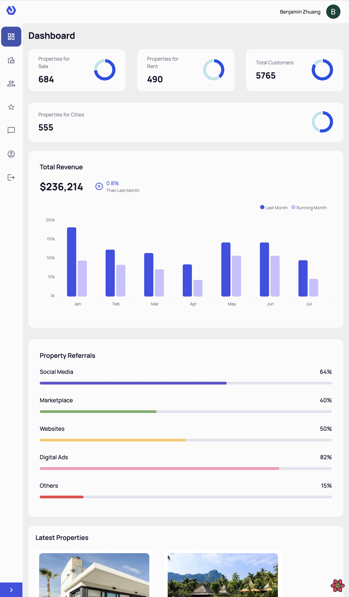
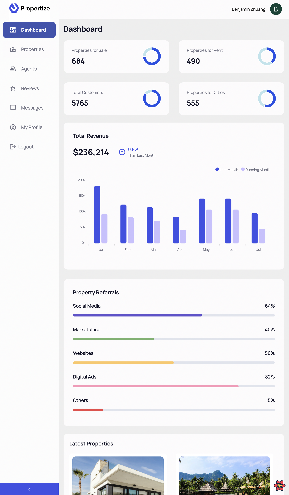
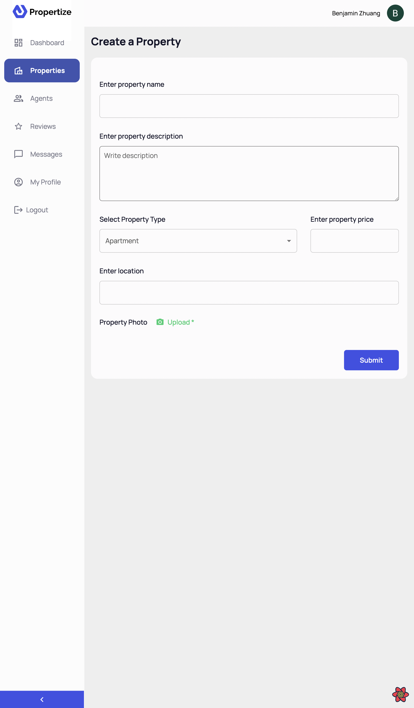
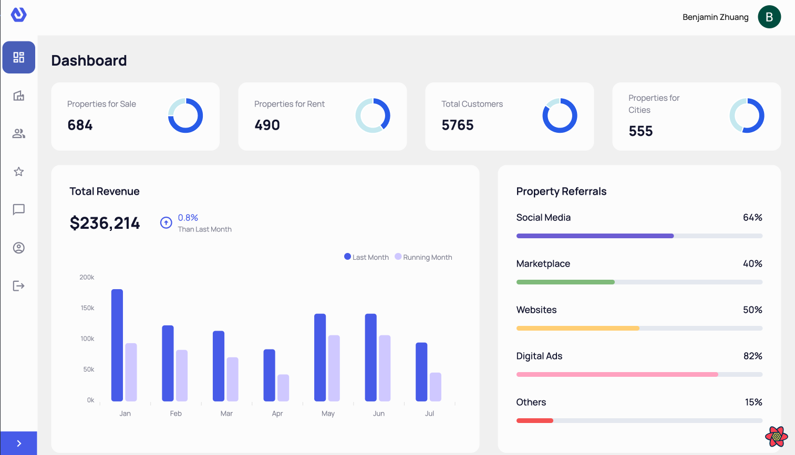
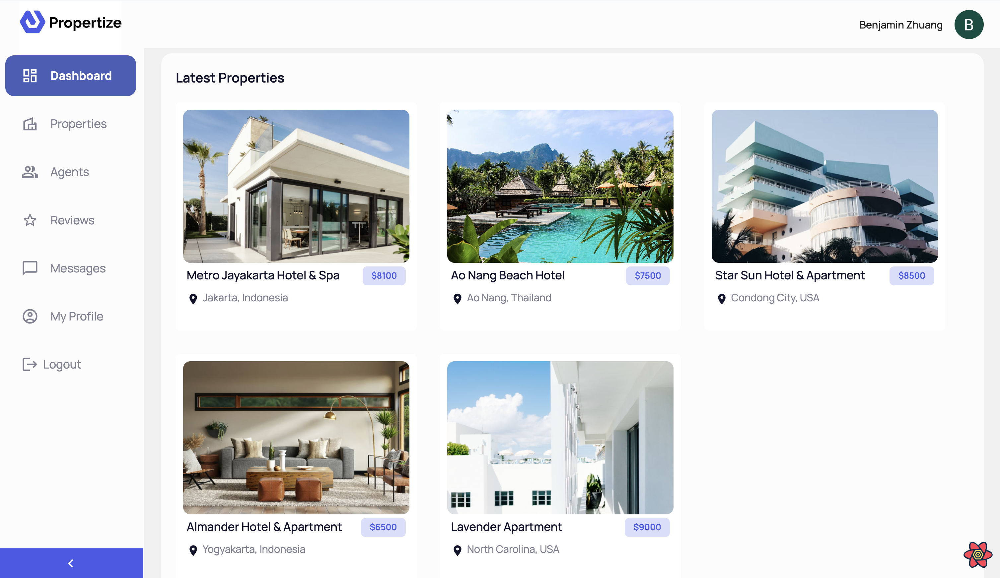

</img>


# What is Propertize?
Propertize is a user-friendly and efficient CRUD real estate dashboard application. Propertize was designed to streamline and simplify property management for real estate adminstrators and agents. The application provides a centralized location for administrators to manage all aspects of real estate, including property listings, property reviews, etc.


# Features
- User-friendly and responsive web designs.
- Google OAuth authentication/authorization. No need to remember another hard combination of username & password.
- Informative dashboard summary with interactive charts for administrators.
- Property listings with support of sorting, search bar, as well as pagination.
- Agent page for detailed agent information and property under managments.
- Review page for summarized performance of each excellent agent as well as useful feedbacks from customers(yet to be implemented).
- Message channel to communicate with agents (yet to be implemented).


# Screenshot Examples
## Vertical Screen
<p align='center'>
     &nbsp; &nbsp;
    
</p>

<p align='center'>
     &nbsp; &nbsp;
</p>

<p align='center'>
     &nbsp; &nbsp;
    
</p>

## Horitonzal Screen
<p align='center'>
     &nbsp; &nbsp;
    
</p>


# Technology Used
- Frontend
    - HTML5
    - CSS
    - React TypeScript
    - Refine
    - Material UI
    - React Router
    - Google OAuth

- Backend
    - Node
    - Express
    - MongoDB
    - MVC design pattern


# App Structures

## Frontend
```
client
├── README.MD
├── package-lock.json
├── package.json
├── public
│   ├── favicon.ico
│   ├── index.html
│   ├── logo.svg
│   └── refine.svg
├── src
│   ├── App.tsx
│   ├── assets
│   │   ├── index.js
│   │   ├── logo.svg
│   │   ├── propertize.svg
│   │   └── yariga.svg
│   ├── components
│   │   ├── agent
│   │   │   └── AgentCard.tsx
│   │   ├── charts
│   │   │   ├── PieChart.tsx
│   │   │   ├── PropertyReferrals.tsx
│   │   │   ├── TotalRevenue.tsx
│   │   │   └── chart.config.ts
│   │   ├── common
│   │   │   ├── CustomButton.tsx
│   │   │   ├── Form.tsx
│   │   │   ├── Profile.tsx
│   │   │   └── PropertyCard.tsx
│   │   ├── home
│   │   │   └── TopAgent.tsx
│   │   ├── index.ts
│   │   └── layout
│   │       ├── header
│   │       │   └── index.tsx
│   │       ├── index.ts
│   │       ├── layout
│   │       │   └── index.tsx
│   │       ├── sider
│   │       │   └── index.tsx
│   │       └── title
│   │           └── index.tsx
│   ├── constants
│   │   └── index.ts
│   ├── contexts
│   │   └── color-mode
│   │       └── index.tsx
│   ├── index.css
│   ├── index.tsx
│   ├── interfaces
│   │   ├── agent.d.ts
│   │   ├── common.d.ts
│   │   ├── google.d.ts
│   │   ├── home.d.ts
│   │   ├── property.d.ts
│   │   └── theme.d.ts
│   ├── meta.json
│   ├── pages
│   │   ├── agent-profile.tsx
│   │   ├── agent.tsx
│   │   ├── all-properties.tsx
│   │   ├── create-property.tsx
│   │   ├── edit-property.tsx
│   │   ├── home.tsx
│   │   ├── index.ts
│   │   ├── login.tsx
│   │   ├── my-profile.tsx
│   │   └── property-details.tsx
│   ├── react-app-env.d.ts
│   ├── reportWebVitals.ts
│   ├── setupTests.ts
│   └── utils
│       └── parse-jwt.ts
└── tsconfig.json
```

## Backend
```
server
├── app.yaml
├── controllers
│   ├── property.controller.js
│   └── user.controller.js
├── index.js
├── mongodb
│   ├── connect.js
│   └── models
│       ├── property.js
│       └── user.js
├── package-lock.json
├── package.json
└── routes
    ├── property.routes.js
    └── user.routes.js
```

# Getting Started
## Running the development client server
```
cd client
npm run dev
```

## Buildinng for production
```
cd client
npm run build
```

## Running the production client server
```
cd client
npm run start
```

## Running the backend server
```
cd server
npm start
```
